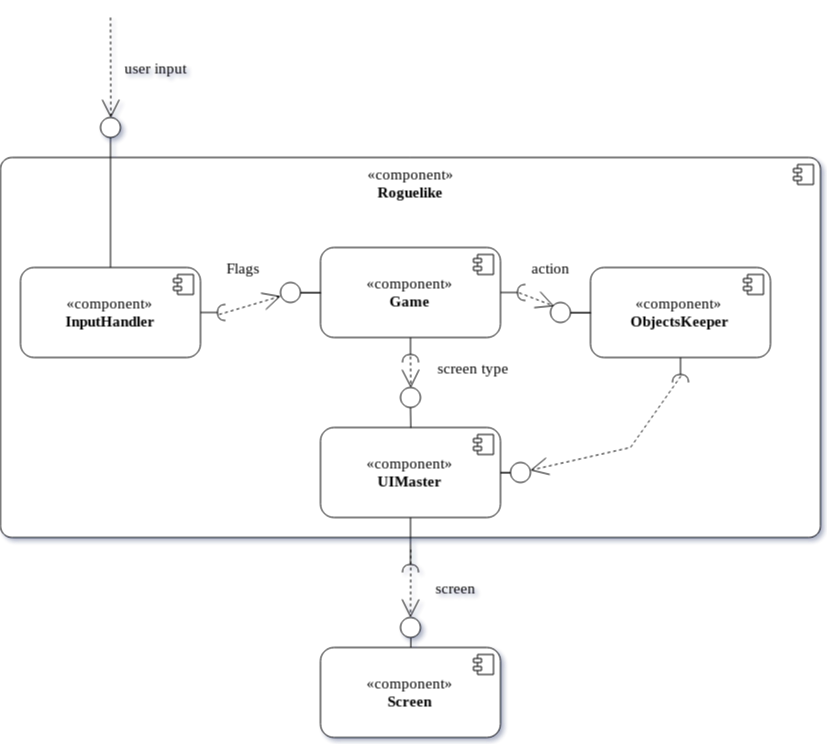
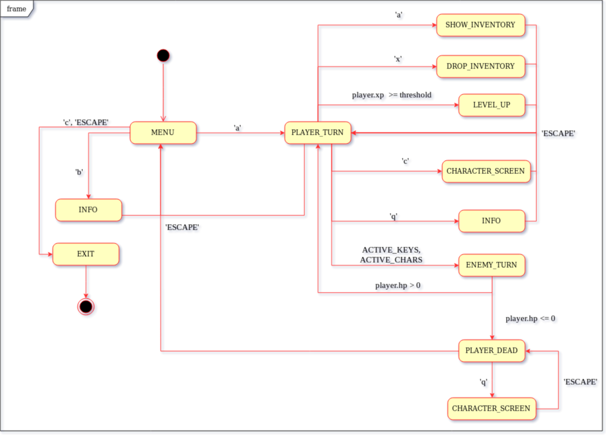
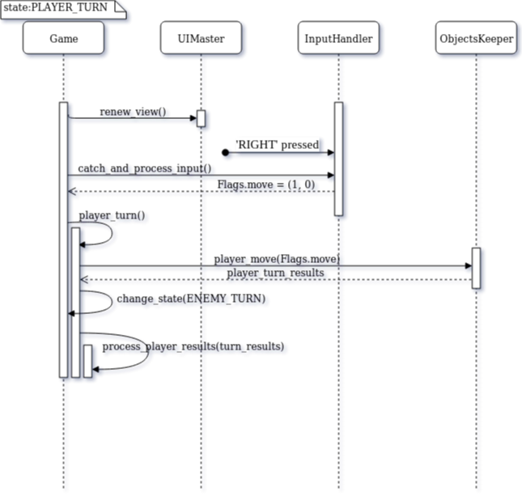

# Simple Roguelike

## What can be extended
As it is very simple roguelike game there are some directions for improvement:
- The logic of the game may be changed for harder one.
- More obstacles and enemies may be created.
- More bonuses such as weapons, potions and treasures.
- Some other skills of the player can be used for more complexity.
- etc.

## Who is the game for
There are some types of players who may be interested:
- The person who wants to waste his/her time with no brain efforts;
- The programmer looking for rogulike game realization;
- The inveterate gamer who wants to try and appreciate this game;
- Me, as creator, testing the game.
- The teacher checking my realization of the roguelike game.

## Architecture description

- The main class **Game** has public method 'run' with the infinite loop where all the work is going on.
 It contains InputHandler, ObjectsKeeper, UIMaster and MessageLog instances.
 The Game takes the user input as Flags from the InputHandler, processes it
 with appropriate methods in the ObjectsKeeper and UIMaster and changes its GameState if it is needed.
    - **GameStates** is a set of all possible states of the game such as:  
    MENU, INFO, PLAYER_TURN, ENEMY_TURN, LEVEL_UP, CHARACTER_SCREEN, SHOW_INVENTORY, DROP_INVENTORY, PLAYER_DEAD, EXIT.

- **InputHandler** takes each user input which is a key that was pressed and converts
it into a Flags class depending on the current state of the game.
    - The **Flags** class is just a container for all flags that may be detected from the user input.
    - The *ACTIVE_KEYS* and *ACTIVE_CHARS* dictionaries contain transformations from user input to flags.
- The **ObjectsKeeper** keeps all objects of the game such as player, GameMap, enemies and other Entities.
It provides their behavior and the interaction between each other.
It has methods for player's actions, enemies moves, killing Entities and switching to the next floor.
- The **UIMaster** keeps the all consoles and windows of the game. It can redraw or erase all parts of graphics.
It also contains a ScreenSwitcher instance that switches a screens by the current GameState.
- The **ScreenSwitcher** class can switch screens between a menu, info, character or inventory screens.
- The **MessageLog** keeps all game Messages.
    - The **Message** is a container for a text and a color of the message.
- The **GameMap** class that implements a map for the current dungeon floor. It randomly creates Rooms, tunnels, Entities and Items on the map.
    - The **Room** is a representation of one room in the dungeon.
- An **EntityFactory** class has a static method for Entities creation by name.
- The **Entity** is a generic class that represents all game entities such as player, enemies, bonuses, etc.
It contains all accessories of the entity and methods for interactions
 with other Entities and essential behavior on the high level.
    - A **RenderOrder** is a enum with types of game roles in drawing order.
- A **Fighter** class implements a role of fighter for Entity.
    It has a health points, a power, a defense. Fighter can attack, be healed and be damaged by enemies.
- The **Equipment** class holds both slots for an entity - the right hand ang the left one,
    manages them and interactions with them. The Entity can toggle equipments it owns.
    - An **Equippable** class holds an equipment in the hand.
    - An **EquipmentSlots** is a enum for slots Entity has.
- An **Inventory** class holds all inventory which the Entity owns.
    It can add, drop, use and remove Items.
- The **Item** represents an item in the game such as a healing potion.
 Has static methods for each item that affects on the Entity, for example, 'heal' for a healing potion.
- A **Level** class contains information about
    the player's level and its experience points.
- A **BasicMonster** class implements a role of an enemy for Entity.
    It hunts the player and injuries it.
- A **UISettings** is a class with all values for a graphics such as
a font, a background picture, RGB colors, etc.

## Components diagram
The Roguelike contains four components: InputHandler, Game, ObjectsKeeper and UIMaster.  
The *InputHandler* component listens to the user input. If something is catched
it will be converted to Flags and passed to the Game. 
The *Game* component performs the logic of the Roguelike game. When it take some Flags
it call appropriate ObjectsKeeper's methods accordingly to the current state. 
The *ObjectsKeeper* component manages all objects of the game. 
The *UIMaster* draws every object of the game by interacting with the computer screen. 

 

## Automata diagram for states of the game

There are ten states of the game. The following automata diagram shows the state depending on the user input
during the game. 

 

## Sequence diagram for one player move

This sequence diagram shows one move that the player do when key 'RIGHT' is pressed. 

 

## Class diagram

Finally, the class diagram for this project. 

 [Class diagram](./src/class_diagram.png)
